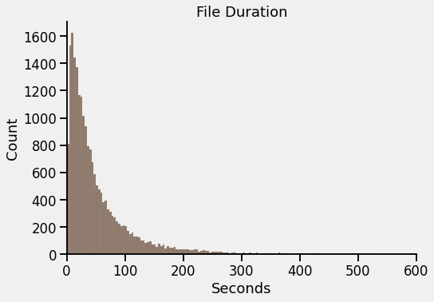
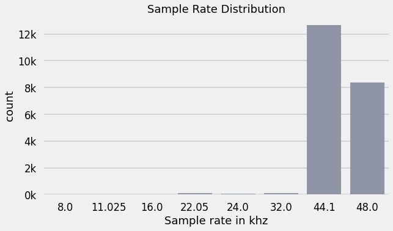
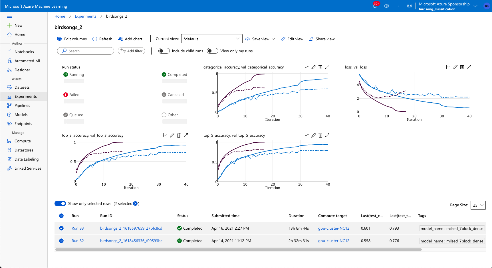
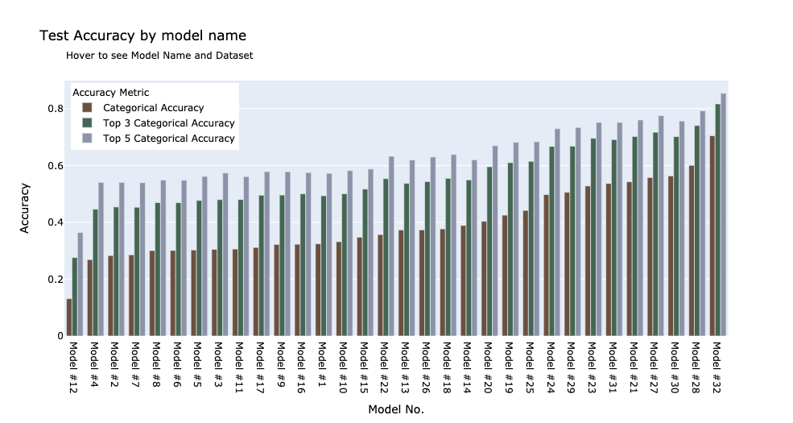

# Bird Sound Classification

Image © Aaron Travers

## Problem Description

Bird migration patterns are changing, and little is know and nighttime bird migration because the communities that generally track birds by sight do so during daylight hours.

Wildlife sounds offer a powerful way to identify species that has some advantages over photographic methods.  For example, bird sounds can be recorded just as easily at night as during the day, and the recording device does not need to be aimed in the direction of the sound to pick it up.

This project aims to build a bird species classifier that uses audio recordings of bird sounds (calls and songs) as its source material.

## The Data

The initial dataset came from the Kaggle competition ["Cornell Birdcall Identification"](https://www.kaggle.com/c/birdsong-recognition) which contains 19,949 mp3 recordings.

I augmented that dataset by using the [xeno-canto.org](http://xeno-canto.org) api to download another 41,335 recordings.

The vast majority of the recordings were only several seconds long.  The shortest recording was less than half a second while the longest was approximately 38 minutes long.

Furthermore, the sampling rate varied between the recordings.  Although the vast majority of recordings had a sample rate of 44.1khz, several other sample rates were represented in the dataset

### Preprocessing

The data was first resampled to 22050hz.  From there two separate training sets were created.

1. In the first set the mp3 files were cropped to the first 10 seconds and converted to wav files.  In cases where the files were shorter than 10 seconds in length, the files were padded with silence to extend them to 10 seconds.
2. The second set included converting the full audio files to numpy arrays and saving them as spy files for faster access with the data augmentation strategies described below.

## Azure Machine Learning SDK for Python

All of the training compute for this project was done on the Azure Machine Learning cloud by way of the AML SDK for Python. This allowed for faster training and more iterations than I could have accomplished on my own computer.  All of the files used for accessing, creating, and running azure assets is located in the `training_scripts` directory.

Some of the models were trained with on compute instance with multiple GPUs.  The number of GPUs used for each model training is recorded in the `training_scripts/runids.csv` and also in the arguments.

`training_scripts/runs.sh` contains all commands run at the command line.  You can run any of the commands there by uncommenting them and running the `./training_scripts/runs.sh` at the command line.

In order to track model training in realtime I wrote a [custom Keras callback](training_scripts/remote/LogToAzure.py) which records metrics after each training Epoch and at the end of the training.

## Modeling

Modeling was done with tensorflow and Keras.  In order to test the effect of the melspecrogram hyper parameters the kapre library [[1]](#1)  

# References 

<a id="1>[1]</a>Choi, Keunwoo, Deokjin Joo, and Juho Kim. “Kapre: On-GPU Audio Preprocessing Layers for a Quick Implementation of Deep Neural Network Models with Keras.” In *Machine Learning for Music Discovery Workshop at 34th International Conference on Machine Learning*. ICML, 2017.