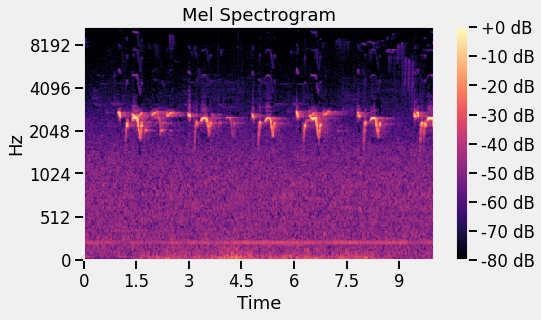
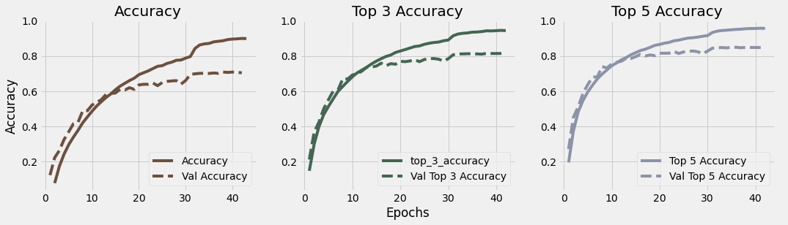
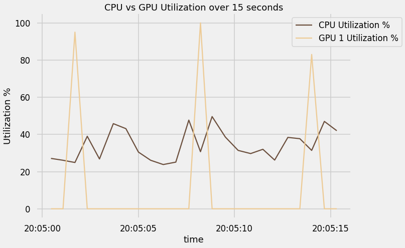

Bird Sound Classification


Image © Aaron Travers

Note: For an interactive demo visit the [project dashboard](https://birdsong-classification.herokuapp.com/) on Heroku.

## Problem Description

Bird migration patterns are changing, and little is know and nighttime bird migration because the communities that generally track birds by sight do so during daylight hours.

Wildlife sounds offer a powerful way to identify species that has some advantages over photographic methods.  For example, bird sounds can be recorded just as easily at night as during the day, and the recording device does not need to be aimed in the direction of the sound to pick it up.

This project aims to build a bird species classifier that uses audio recordings of bird sounds (calls and songs) as its source material.

## The Data

The initial dataset came from the Kaggle competition ["Cornell Birdcall Identification"](https://www.kaggle.com/c/birdsong-recognition) which contains 19,949 mp3 recordings.

The recordings are of 264 species recorded at locations around the world illustrated below.


The vast majority of the recordings were only several seconds long.  The shortest recording was less than half a second while the longest was approximately 38 minutes long.


Furthermore, the sampling rate varied between the recordings.  Although the vast majority of recordings had a sample rate of 44.1khz, several other sample rates were represented in the dataset


### Additional Data

I augmented that dataset by using the [xeno-canto.org](http://xeno-canto.org) api to download another 41,335 recordings of the same species.

### Preprocessing

The data was first resampled to 22050hz.  From there two separate training sets were created.

1. In the first set the mp3 files were cropped to the first 10 seconds and converted to wav files.  In cases where the files were shorter than 10 seconds in length, the files were padded with silence to extend them to 10 seconds.
2. The second set included converting the full audio files to numpy arrays saved as npy files.  This allowed for faster access with the data augmentation strategies described below.

### Data Augmentation

I developed a custom DataGenerator ([AugDataGenerator](training_scripts/remote/DataGenerator.py)) which performed the following data augmentations for evaluation of their effectiveness.

- Extraction of a random 10 second sample from the recordings
- Pitch Shift
- Time Stretch

As expected, the extraction of random 10 second samples from the data did improve the model effectiveness significantly.  Pitch and Time Stretch however slightly diminished the model's predictive power and so they were not used in the best model.

## Azure Machine Learning SDK for Python

All of the training compute for this project was done on the Azure Machine Learning cloud by way of the AML SDK for Python. This allowed for faster training and more iterations than I could have accomplished on my own computer.  All of the files used for accessing, creating, and running azure assets is located in the `training_scripts` directory.

Some of the models were trained with on compute instance with multiple GPUs.  The number of GPUs used for each model training is recorded in the `training_scripts/runids.csv` and also in the arguments.

`training_scripts/runs.sh` contains all commands run at the command line.  You can run any of the commands there by uncommenting them and running the `./training_scripts/runs.sh` at the command line.

In order to track model training in realtime I wrote a [custom Keras callback](training_scripts/remote/LogToAzure.py) which records metrics after each training Epoch and at the end of the training.


## Modeling

Modeling was done with tensorflow and Keras.  In order to test the effect of the Mel Specrogram hyper parameters I used the kapre library [[1]](#1) to add eras layers to which dynamically generate the Mel Spectrograms during training.  The Mel Spectrogram is a matrix representation of frequency magnitude that bins frequencies on a log scale similar to how humans hear and measures magnitude in decibels.  The Mel Spectrogram can be visualized as heat map.  In doing so we can clearly "see" the bird vocalization represented as an image.



Once the sound has an image representation we can use a traditional Convolutional Neural Network to extract features and make predictions.  I tested 30 different models in this project and the test accuracy for each is charted below.


### Model Summary

The best performing model:

- Name: `milsed_7block_dense`
- Data: kaggle_full_length_npy_aug

#### Model: `milsed_7block_dense`

`milsed_7block_dense` uses layers from kapre to generate the mel spectrogram from the audio source.  The resulting mel spectrogram was then passed through 7 convolution blocks, each with two conv2d layers  inspired by the convolution layers used in "Adaptive Pooling Operators for Weakly Labeled Sound Event Detection" [[2]](#2).  Each block contains a conv2d layer with a (3, 3) kernel and relu activation, batch_normalization, another conv2d (3,3) with relu layer, followed by a Max Pooling layer with a kernel size of (3,3).  The rest of the model consists of Global Max Pooling to flatten the output, two Dense layers and a final Dense layer with 246 nodes and a softmax activation function for the final prediction.

```
Model: "sequential"
_________________________________________________________________
Layer (type)                 Output Shape              Param #   
=================================================================
stft (STFT)                  (None, 427, 1025, 1)      0         
_________________________________________________________________
magnitude (Magnitude)        (None, 427, 1025, 1)      0         
_________________________________________________________________
apply_filterbank (ApplyFilte (None, 427, 256, 1)       0         
_________________________________________________________________
magnitude_to_decibel (Magnit (None, 427, 256, 1)       0         
_________________________________________________________________
batch_normalization (BatchNo (None, 427, 256, 1)       4         
_________________________________________________________________
conv2d (Conv2D)              (None, 427, 256, 16)      160       
_________________________________________________________________
batch_normalization_1 (Batch (None, 427, 256, 16)      64        
_________________________________________________________________
conv2d_1 (Conv2D)            (None, 427, 256, 16)      2320      
_________________________________________________________________
batch_normalization_2 (Batch (None, 427, 256, 16)      64        
_________________________________________________________________
max_pooling2d (MaxPooling2D) (None, 213, 128, 16)      0         
_________________________________________________________________
conv2d_2 (Conv2D)            (None, 213, 128, 32)      4640      
_________________________________________________________________
batch_normalization_3 (Batch (None, 213, 128, 32)      128       
_________________________________________________________________
conv2d_3 (Conv2D)            (None, 213, 128, 32)      9248      
_________________________________________________________________
batch_normalization_4 (Batch (None, 213, 128, 32)      128       
_________________________________________________________________
max_pooling2d_1 (MaxPooling2 (None, 106, 64, 32)       0         
_________________________________________________________________
conv2d_4 (Conv2D)            (None, 106, 64, 64)       18496     
_________________________________________________________________
batch_normalization_5 (Batch (None, 106, 64, 64)       256       
_________________________________________________________________
conv2d_5 (Conv2D)            (None, 106, 64, 64)       36928     
_________________________________________________________________
batch_normalization_6 (Batch (None, 106, 64, 64)       256       
_________________________________________________________________
max_pooling2d_2 (MaxPooling2 (None, 53, 32, 64)        0         
_________________________________________________________________
conv2d_6 (Conv2D)            (None, 53, 32, 128)       73856     
_________________________________________________________________
batch_normalization_7 (Batch (None, 53, 32, 128)       512       
_________________________________________________________________
conv2d_7 (Conv2D)            (None, 53, 32, 128)       147584    
_________________________________________________________________
batch_normalization_8 (Batch (None, 53, 32, 128)       512       
_________________________________________________________________
max_pooling2d_3 (MaxPooling2 (None, 26, 16, 128)       0         
_________________________________________________________________
conv2d_8 (Conv2D)            (None, 26, 16, 256)       295168    
_________________________________________________________________
batch_normalization_9 (Batch (None, 26, 16, 256)       1024      
_________________________________________________________________
conv2d_9 (Conv2D)            (None, 26, 16, 256)       590080    
_________________________________________________________________
batch_normalization_10 (Batc (None, 26, 16, 256)       1024      
_________________________________________________________________
max_pooling2d_4 (MaxPooling2 (None, 13, 8, 256)        0         
_________________________________________________________________
conv2d_10 (Conv2D)           (None, 13, 8, 512)        1180160   
_________________________________________________________________
batch_normalization_11 (Batc (None, 13, 8, 512)        2048      
_________________________________________________________________
conv2d_11 (Conv2D)           (None, 13, 8, 512)        2359808   
_________________________________________________________________
batch_normalization_12 (Batc (None, 13, 8, 512)        2048      
_________________________________________________________________
max_pooling2d_5 (MaxPooling2 (None, 6, 4, 512)         0         
_________________________________________________________________
conv2d_12 (Conv2D)           (None, 6, 4, 1024)        4719616   
_________________________________________________________________
batch_normalization_13 (Batc (None, 6, 4, 1024)        4096      
_________________________________________________________________
conv2d_13 (Conv2D)           (None, 6, 4, 1024)        9438208   
_________________________________________________________________
batch_normalization_14 (Batc (None, 6, 4, 1024)        4096      
_________________________________________________________________
max_pooling2d_6 (MaxPooling2 (None, 3, 2, 1024)        0         
_________________________________________________________________
global_max_pooling2d (Global (None, 1024)              0         
_________________________________________________________________
dense (Dense)                (None, 1028)              1053700   
_________________________________________________________________
dense_1 (Dense)              (None, 512)               526848    
_________________________________________________________________
dense_2 (Dense)              (None, 264)               135432    
=================================================================
Total params: 20,608,512
Trainable params: 20,600,382
Non-trainable params: 8,130
_________________________________________________________________
```

#### Data: `kaggle_full_length_npy_aug`

The dataset `kaggle_full_length_npy_aug` used full length audio files with 10 second data extraction for augmentation as described above.

## Performance

### Train/Validation Accuracy

I tracked 3 accuracy metrics during training: accuracy, top 3 accuracy, and top 5 accuracy.



### Test Accuracy


There is some overfitting, however the test accuracy is almost identical to the validation accuracy which indicates that the overfitting does not negatively affect model performance.

### Confusion Matrix

Although there are too many classes to fit comfortably in the confusion matrix, the matrix is still informative.  It shows a strong tendency toward correct classification and no obvious recurring mis-classifications.


### Classification Report

The classification report exposes some interesting (and expected) details.  Some birds with a small number of samples are not ever predicted (i.e. Bufflehead).  All in all the model is fairly balanced with 

```
                               precision    recall  f1-score   support

             Alder Flycatcher       0.69      0.73      0.71        15
              American Avocet       0.75      0.50      0.60         6
             American Bittern       1.00      0.86      0.92         7
             American Bushtit       0.93      0.87      0.90        15
       American Cliff Swallow       0.88      0.70      0.78        10
                American Coot       0.87      0.87      0.87        15
                American Crow       0.70      0.93      0.80        15
    American Dusky Flycatcher       0.91      0.67      0.77        15
           American Goldfinch       0.61      0.93      0.74        15
     American Grey Flycatcher       0.62      0.67      0.64        12
             American Kestrel       1.00      0.91      0.95        11
            American Redstart       0.67      0.80      0.73        15
               American Robin       0.60      1.00      0.75        15
        American Tree Sparrow       0.90      0.82      0.86        11
              American Wigeon       1.00      0.80      0.89         5
            American Woodcock       0.86      1.00      0.92        12
           Anna's Hummingbird       0.75      0.80      0.77        15
      Ash-throated Flycatcher       0.88      1.00      0.94        15
            Baird's Sandpiper       0.86      0.75      0.80         8
                   Bald Eagle       0.80      0.80      0.80         5
             Baltimore Oriole       0.88      0.47      0.61        15
                 Barn Swallow       1.00      0.87      0.93        15
                   Barred Owl       0.92      0.73      0.81        15
               Bell's Sparrow       0.85      1.00      0.92        11
            Belted Kingfisher       1.00      1.00      1.00        10
                Bewick's Wren       0.67      0.93      0.78        15
                 Black Phoebe       0.93      0.93      0.93        15
      Black-and-white Warbler       1.00      0.91      0.95        11
          Black-billed Cuckoo       1.00      0.71      0.83         7
          Black-billed Magpie       0.78      0.78      0.78         9
       Black-capped Chickadee       0.79      0.73      0.76        15
    Black-chinned Hummingbird       0.75      0.30      0.43        10
        Black-headed Grosbeak       1.00      0.87      0.93        15
           Black-necked Grebe       0.83      0.83      0.83         6
  Black-throated Blue Warbler       0.70      0.64      0.67        11
 Black-throated Green Warbler       0.92      0.73      0.81        15
  Black-throated Grey Warbler       0.70      0.50      0.58        14
       Black-throated Sparrow       1.00      0.71      0.83        14
         Blackburnian Warbler       0.81      0.87      0.84        15
            Blackpoll Warbler       0.88      0.93      0.90        15
                Blue Grosbeak       0.81      0.87      0.84        15
                     Blue Jay       0.76      0.87      0.81        15
        Blue-grey Gnatcatcher       0.81      0.87      0.84        15
            Blue-headed Vireo       0.73      0.73      0.73        15
             Blue-winged Teal       0.88      0.88      0.88         8
          Blue-winged Warbler       0.89      0.53      0.67        15
                     Bobolink       0.92      0.73      0.81        15
             Bonaparte's Gull       1.00      0.50      0.67         6
           Brewer's Blackbird       1.00      0.43      0.60         7
             Brewer's Sparrow       1.00      0.93      0.97        15
     Broad-tailed Hummingbird       0.92      0.80      0.86        15
            Broad-winged Hawk       0.83      0.91      0.87        11
                Brown Creeper       0.83      1.00      0.91        15
               Brown Thrasher       0.82      0.93      0.87        15
         Brown-headed Cowbird       0.86      0.80      0.83        15
           Buff-bellied Pipit       1.00      0.93      0.97        15
                   Bufflehead       1.00      0.50      0.67         2
             Bullock's Oriole       0.77      0.67      0.71        15
                  Cactus Wren       0.88      1.00      0.94        15
              California Gull       1.00      0.33      0.50         6
             California Quail       0.87      0.93      0.90        14
         California Scrub Jay       0.90      0.90      0.90        10
                 Canada Goose       1.00      1.00      1.00        15
               Canada Warbler       1.00      0.60      0.75        15
                  Canyon Wren       0.93      0.87      0.90        15
             Cape May Warbler       0.89      0.73      0.80        11
                Carolina Wren       0.94      1.00      0.97        15
                 Caspian Tern       0.93      0.87      0.90        15
               Cassin's Finch       0.70      0.64      0.67        11
               Cassin's Vireo       0.80      0.57      0.67        14
                Cedar Waxwing       1.00      1.00      1.00        13
       Chestnut-sided Warbler       0.93      0.87      0.90        15
                Chimney Swift       1.00      1.00      1.00         4
             Chipping Sparrow       0.72      0.87      0.79        15
             Chukar Partridge       0.75      0.75      0.75         4
           Clark's Nutcracker       0.91      0.83      0.87        12
             Common Goldeneye       0.83      0.77      0.80        13
               Common Grackle       0.92      0.80      0.86        15
                  Common Loon       0.83      1.00      0.91        10
             Common Merganser       0.90      0.75      0.82        12
             Common Nighthawk       0.71      0.77      0.74        13
               Common Redpoll       0.93      0.93      0.93        15
              Common Starling       0.30      1.00      0.46         6
                  Common Tern       0.68      1.00      0.81        15
          Common Yellowthroat       0.70      0.93      0.80        15
                Cooper's Hawk       0.68      0.93      0.79        14
          Costa's Hummingbird       1.00      0.67      0.80         3
              Dark-eyed Junco       0.69      0.73      0.71        15
     Double-crested Cormorant       0.60      0.60      0.60         5
             Downy Woodpecker       0.87      0.87      0.87        15
             Eastern Bluebird       0.86      0.86      0.86        14
             Eastern Kingbird       1.00      0.83      0.91        12
           Eastern Meadowlark       0.78      0.93      0.85        15
               Eastern Phoebe       1.00      0.79      0.88        14
               Eastern Towhee       0.73      0.73      0.73        15
           Eastern Wood Pewee       1.00      0.87      0.93        15
       Eurasian Collared Dove       1.00      1.00      1.00        15
                Eurasian Teal       0.87      0.87      0.87        15
        European Herring Gull       0.88      0.93      0.90        15
             Evening Grosbeak       1.00      1.00      1.00        15
                Field Sparrow       0.92      0.80      0.86        15
                    Fish Crow       1.00      0.77      0.87        13
                      Gadwall       0.88      0.93      0.90        15
                 Golden Eagle       1.00      0.38      0.55         8
       Golden-crowned Kinglet       0.78      0.93      0.85        15
       Golden-crowned Sparrow       0.88      0.70      0.78        10
             Great Blue Heron       0.79      1.00      0.88        11
     Great Crested Flycatcher       0.87      0.87      0.87        15
                  Great Egret       0.87      0.87      0.87        15
             Great Horned Owl       0.94      1.00      0.97        15
         Great-tailed Grackle       0.58      0.73      0.65        15
           Greater Roadrunner       1.00      0.93      0.96        14
           Greater Yellowlegs       0.78      0.93      0.85        15
                  Green Heron       0.86      0.60      0.71        10
          Green-tailed Towhee       0.80      0.80      0.80        15
                 Grey Catbird       0.90      0.75      0.82        12
      Grey-crowned Rosy Finch       0.50      0.20      0.29         5
             Hairy Woodpecker       0.91      0.67      0.77        15
         Hammond's Flycatcher       0.85      0.73      0.79        15
                Hermit Thrush       1.00      0.87      0.93        15
             Hooded Merganser       1.00      0.33      0.50         3
               Hooded Warbler       0.94      1.00      0.97        15
                 Horned Grebe       0.67      0.80      0.73        10
                  Horned Lark       1.00      1.00      1.00        15
                  House Finch       0.81      0.87      0.84        15
                House Sparrow       0.79      1.00      0.88        15
                   House Wren       0.52      0.93      0.67        15
               Indigo Bunting       0.93      0.87      0.90        15
             Juniper Titmouse       0.90      0.90      0.90        10
                     Killdeer       0.93      0.87      0.90        15
     Ladder-backed Woodpecker       0.89      0.62      0.73        13
                 Lark Sparrow       0.82      0.64      0.72        14
               Lazuli Bunting       0.77      0.67      0.71        15
           LeConte's Thrasher       1.00      1.00      1.00         3
                Least Bittern       0.80      0.86      0.83        14
             Least Flycatcher       0.77      0.71      0.74        14
              Least Sandpiper       1.00      0.64      0.78        11
             Lesser Goldfinch       0.75      1.00      0.86        15
             Lesser Nighthawk       1.00      1.00      1.00         6
            Lesser Yellowlegs       0.92      0.80      0.86        15
           Lewis's Woodpecker       1.00      1.00      1.00         4
            Lincoln's Sparrow       0.87      0.87      0.87        15
            Loggerhead Shrike       1.00      0.87      0.93        15
           Long-billed Curlew       1.00      0.60      0.75        10
        Long-billed Dowitcher       1.00      0.91      0.95        11
             Long-tailed Duck       1.00      1.00      1.00         9
        Louisiana Waterthrush       0.93      0.87      0.90        15
       MacGillivray's Warbler       0.64      0.60      0.62        15
             Magnolia Warbler       0.87      0.87      0.87        15
                      Mallard       0.81      0.87      0.84        15
             Mangrove Warbler       0.82      0.69      0.75        13
                   Marsh Wren       0.76      0.87      0.81        15
                       Merlin       1.00      1.00      1.00         9
            Mountain Bluebird       0.67      1.00      0.80         4
           Mountain Chickadee       0.88      0.93      0.90        15
                Mourning Dove       0.81      0.87      0.84        15
               Myrtle Warbler       0.72      0.87      0.79        15
            Northern Cardinal       0.71      1.00      0.83        15
             Northern Flicker       0.75      1.00      0.86        15
             Northern Harrier       1.00      0.50      0.67         4
         Northern Mockingbird       0.42      0.67      0.51        15
              Northern Parula       0.88      0.93      0.90        15
             Northern Pintail       0.83      0.83      0.83         6
               Northern Raven       0.64      0.93      0.76        15
Northern Rough-winged Swallow       1.00      1.00      1.00         4
            Northern Shoveler       1.00      1.00      1.00        10
         Northern Waterthrush       0.76      0.87      0.81        15
         Nuttall's Woodpecker       0.75      0.86      0.80         7
       Olive-sided Flycatcher       1.00      0.80      0.89        15
       Orange-crowned Warbler       0.73      0.73      0.73        15
                     Ovenbird       0.85      0.73      0.79        15
     Pacific-slope Flycatcher       0.93      0.87      0.90        15
                 Palm Warbler       0.67      0.57      0.62         7
           Pectoral Sandpiper       0.80      0.40      0.53        10
             Peregrine Falcon       1.00      0.87      0.93        15
                  Phainopepla       1.00      0.78      0.88         9
            Pied-billed Grebe       1.00      0.87      0.93        15
          Pileated Woodpecker       1.00      0.80      0.89        15
                Pine Grosbeak       0.80      0.57      0.67        14
                  Pine Siskin       1.00      0.93      0.97        15
                 Pine Warbler       0.92      0.80      0.86        15
                   Pinyon Jay       1.00      1.00      1.00         8
              Plumbeous Vireo       0.79      0.79      0.79        14
              Prairie Warbler       1.00      0.80      0.89        10
                 Purple Finch       0.73      0.73      0.73        15
               Pygmy Nuthatch       0.71      0.56      0.63         9
                Red Crossbill       0.56      0.93      0.70        15
              Red Fox Sparrow       0.92      0.73      0.81        15
       Red-bellied Woodpecker       0.88      0.93      0.90        15
       Red-breasted Merganser       1.00      0.75      0.86         4
        Red-breasted Nuthatch       0.92      0.73      0.81        15
       Red-breasted Sapsucker       0.29      0.40      0.33         5
               Red-eyed Vireo       0.76      0.87      0.81        15
         Red-necked Phalarope       0.82      0.82      0.82        11
          Red-shouldered Hawk       1.00      0.82      0.90        11
              Red-tailed Hawk       0.93      0.93      0.93        14
         Red-winged Blackbird       0.74      0.93      0.82        15
                      Redhead       0.50      1.00      0.67         1
             Ring-billed Gull       0.62      1.00      0.77        10
             Ring-necked Duck       1.00      0.50      0.67         4
                    Rock Dove       1.00      0.80      0.89        15
                    Rock Wren       0.92      0.92      0.92        12
       Rose-breasted Grosbeak       0.87      0.87      0.87        15
         Ruby-crowned Kinglet       0.93      0.93      0.93        15
    Ruby-throated Hummingbird       0.38      0.60      0.46         5
                   Ruddy Duck       0.75      1.00      0.86         3
                Ruffed Grouse       1.00      0.50      0.67         4
           Rufous Hummingbird       0.88      0.78      0.82         9
              Rusty Blackbird       0.75      0.67      0.71         9
                Sage Thrasher       1.00      0.80      0.89         5
            Sagebrush Sparrow       0.75      0.75      0.75         4
                  Sand Martin       1.00      0.87      0.93        15
             Savannah Sparrow       1.00      0.93      0.97        15
                 Say's Phoebe       1.00      1.00      1.00         8
              Scarlet Tanager       0.93      1.00      0.97        14
               Scott's Oriole       1.00      1.00      1.00        15
          Semipalmated Plover       0.86      0.60      0.71        10
       Semipalmated Sandpiper       0.62      0.50      0.56        10
           Sharp-shinned Hawk       0.50      0.67      0.57         3
              Short-eared Owl       0.78      0.78      0.78         9
                 Snow Bunting       0.85      0.73      0.79        15
                   Snow Goose       1.00      1.00      1.00        12
           Solitary Sandpiper       1.00      0.79      0.88        14
                 Song Sparrow       0.68      1.00      0.81        15
                         Sora       0.93      0.93      0.93        15
            Spotted Sandpiper       0.88      0.50      0.64        14
               Spotted Towhee       0.70      0.93      0.80        15
                Steller's Jay       0.72      0.87      0.79        15
              Swainson's Hawk       0.67      0.50      0.57         4
            Swainson's Thrush       0.73      0.73      0.73        15
                Swamp Sparrow       1.00      0.67      0.80        15
                 Tree Swallow       0.80      0.62      0.70        13
               Trumpeter Swan       0.83      0.83      0.83         6
              Tufted Titmouse       0.86      0.80      0.83        15
                  Tundra Swan       0.83      1.00      0.91        10
                        Veery       0.93      0.87      0.90        15
               Vesper Sparrow       1.00      1.00      1.00        15
         Violet-green Swallow       1.00      0.75      0.86         8
               Warbling Vireo       0.75      0.80      0.77        15
             Western Bluebird       0.80      0.80      0.80         5
                Western Grebe       0.83      0.83      0.83         6
             Western Kingbird       0.82      0.75      0.78        12
           Western Meadowlark       0.83      1.00      0.91        15
               Western Osprey       0.92      0.73      0.81        15
            Western Sandpiper       0.50      0.75      0.60         4
              Western Tanager       0.93      0.87      0.90        15
           Western Wood Pewee       0.78      0.93      0.85        15
      White-breasted Nuthatch       0.76      0.87      0.81        15
        White-crowned Sparrow       0.68      1.00      0.81        15
             White-faced Ibis       0.50      0.80      0.62         5
       White-throated Sparrow       0.82      0.93      0.87        15
         White-throated Swift       1.00      0.80      0.89         5
                  Wild Turkey       0.50      0.43      0.46         7
            Willow Flycatcher       0.67      0.80      0.73        15
               Wilson's Snipe       1.00      0.93      0.97        15
             Wilson's Warbler       0.67      0.93      0.78        15
                  Winter Wren       0.87      0.87      0.87        15
                    Wood Duck       1.00      0.83      0.91         6
                  Wood Thrush       0.93      0.93      0.93        15
        Woodhouse's Scrub Jay       0.86      0.92      0.89        13
    Yellow-bellied Flycatcher       1.00      0.93      0.97        15
     Yellow-bellied Sapsucker       0.86      0.67      0.75         9
      Yellow-headed Blackbird       0.50      0.56      0.53         9
        Yellow-throated Vireo       0.88      0.93      0.90        15

                     accuracy                           0.83      3204
                    macro avg       0.84      0.81      0.81      3204
                 weighted avg       0.85      0.83      0.83      3204
```


## Training Efficiency

Unfortunately the custom data generator resulted in inefficient use of resources as seen in the plot below.  I did not record file load times, but the los cpu utilization between GPU spikes seems to indicate that the loading of the audio files themselves was constraining the system.  The files were processed in parallel on all CPUs available but still the CPU only reached 60%.

For larger training sets this would need to be addressed.



# Dashboard

To upload your own recordings for prediction or to dig deeper into the metrics for the other models I have deployed a dashboard on Heroku.  The dashboard uses a Docker Container to install ffmpeg for mp3 processing to facilitate the upload and prediction.  It is build using Plotly's [Dash](https://plotly.com/dash/).  To see more on how the dashboard works visit the [dashboard repository](https://github.com/benbogart/birdsong_detection_dashboard_docker) on GitHub.

[](https://birdsong-classification.herokuapp.com/)

# Future Work

1. Further improvements might be possible by **testing other model architectures** like LSTM or attention based networks.
2. Create a Sound Event Detection model leveraging the AutoPooling layer from “Adaptive Pooling Operators for Weakly Labeled Sound Event Detection.”  This could have the added benefit of detecting multiple species in a recording.
3. Develop an open source mobile app so the community can improve the modeling and the benefits of the model can be leveraged by hobbyists and researchers alike.
4. Improve training efficiency by using a different data loading methodology.

# Conclusion

Its clear form this work that bird vocalization classification is a viable way to classify bird species.  Pitch shift and time stretching the audio data had a nominally negative effect on the model performance, and are computationally expensive, therefor use of those augmentation strategies is not recommended.  Data augmentation by selecting random samples and downloading more samples does significantly improve the training.

# References 

<a id="1">[1]</a>Choi, Keunwoo, Deokjin Joo, and Juho Kim. “Kapre: On-GPU Audio Preprocessing Layers for a Quick Implementation of Deep Neural Network Models with Keras.” In *Machine Learning for Music Discovery Workshop at 34th International Conference on Machine Learning*. ICML, 2017.

<a id="2">[2]</a>McFee, Brian, Justin Salamon, and Juan Pablo Bello. “Adaptive Pooling Operators for Weakly Labeled Sound Event Detection.” *ArXiv:1804.10070 [Cs, Eess, Stat]*, August 10, 2018. http://arxiv.org/abs/1804.10070.

